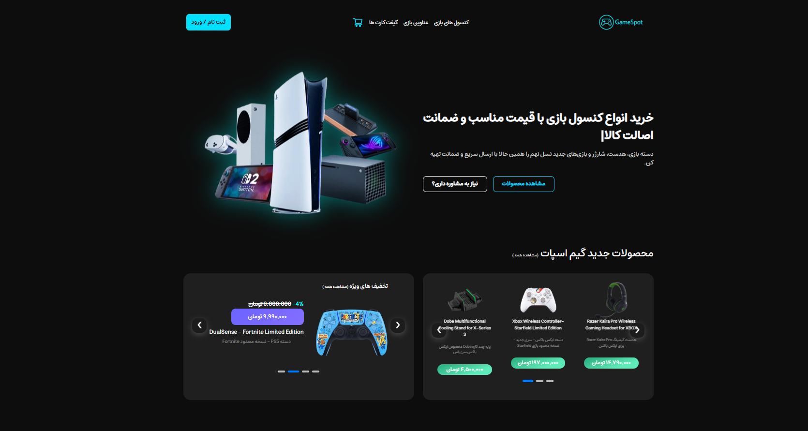
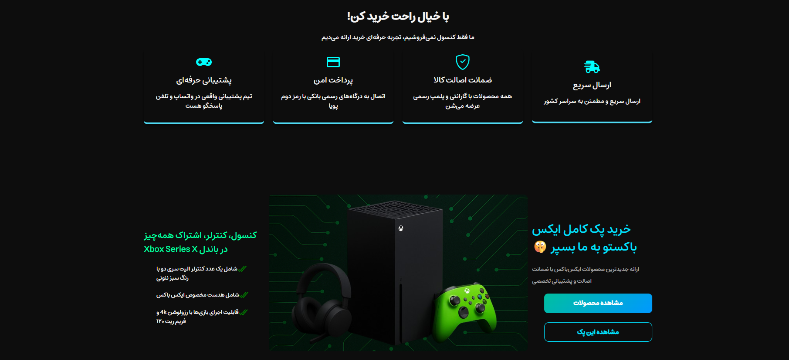

# 🎮 GameSpot - فروشگاه آنلاین لوازم گیمینگ

**GameSpot** یک پروژه‌ی فروشگاه اینترنتی لوازم گیمینگ است که با استفاده از MERN Stack طراحی و پیاده‌سازی شده. این پروژه با هدف نمایش مهارت‌های فرانت‌اند و بک‌اند توسعه‌دهنده ایجاد شده و شامل امکانات کامل احراز هویت، مدیریت محصولات، ثبت سفارش، ارسال ایمیل و پنل مدیریت حرفه‌ای می‌باشد.

---

## 🚀 تکنولوژی‌ها

### فرانت‌اند:

- React
- Redux & Redux Persist
- React Router DOM
- Axios
- React-Bootstrap
- Framer Motion
- Swiper
- Recharts
- React Type Animation
- React Icons
- React Helmet Async
- SweetAlert2
- XLSX
- React Hot Toast

### بک‌اند:

- Node.js
- Express
- MongoDB + Mongoose
- Nodemailer
- nodemon
- JWT (jsonwebtoken)
- Bcrypt
- Helmet
- Cookie-parser
- dotenv
- cors
- Fastest-Validator

---

## 🔐 احراز هویت

- کاربران می‌توانند ثبت‌نام و ورود انجام دهند.
- پس از ورود، توکن JWT تولید می‌شود.
- دسترسی به پنل کاربری تنها با توکن معتبر ممکن است.
- دسترسی به پنل ادمین فقط با ایمیل و رمزعبور معتبر (ذخیره‌شده در پایگاه‌داده) امکان‌پذیر است.

---

## 🛒 ویژگی‌های سایت

### ✅ عمومی:

- طراحی کاملاً واکنش‌گرا (Responsive)
- استفاده از انیمیشن‌های حرفه‌ای با Framer Motion
- سبد خرید پویا با امکان:
  - اضافه‌کردن محصولات
  - جلوگیری از افزودن تکراری
  - تعیین تعداد کالا
  - اعتبارسنجی تعداد (محدود به موجودی)
  - محاسبه خودکار مبلغ کل
  - حذف کالاها از سبد خرید
- ثبت سفارش از طریق فرم سفارشی (بدون درگاه بانکی)
- ذخیره اطلاعات سفارش در پایگاه‌داده
- ارسال ایمیل تایید سفارش به کاربر با جزییات خرید

---

## 👤 پنل کاربری

- مشاهده و ویرایش اطلاعات حساب
- تغییر رمز عبور
- وارد کردن اطلاعات دفترچه آدرس
- مشاهده تاریخچه سفارشات (سفارشات من)
- لیست علاقه‌مندی‌ها:
  - افزودن محصولات به لیست علاقه‌مندی
  - امکان اضافه‌کردن از علاقه‌مندی به سبد خرید
- سیستم پیام‌رسان داخلی برای ارسال پیام به ادمین و دریافت پاسخ

---

## 🛠️ پنل مدیریت (Admin Panel)

- ورود امن با ایمیل و رمزعبور
- مشاهده لیست کاربران و امکان حذف آن‌ها
- پاسخ‌گویی به پیام‌های کاربران
- مشاهده موجودی انبار
- خروجی گرفتن از لیست محصولات به فایل Excel (با کتابخانه `xlsx`)
- نمایش آمار بازدید سایت و تعاملات کاربران با:
  - نمودار دایره‌ای و میله‌ای با Recharts
  - نمایش تعداد بازدید روزانه و کاربران جدید
  - (اطلاعات آماری در حال حاضر به‌صورت استاتیک هستند)
- گزینه خروج از حساب ادمین

---

## 📷 پیش‌نمایش





> (در صورت تمایل می‌توانید تصاویر بیشتری از صفحات مختلف مانند پنل کاربری، سبد خرید، پنل مدیریت و... اضافه کنید.)

---

## 🧪 اجرای پروژه در محیط لوکال

## اطلاعاتی که باید در فایل .env بزارید به شرح زیر است

## فایل .env.exampel. رو پاک کنید

## فایل .env را بسازید و اطلاعات مورد نیاز زیر رو بنویسید

PORT=5000  
MONGO_URI=your_mongodb_connection_string  
JWT_SECRET=your_jwt_secret  
EMAIL_USER=your_email@gmail.com  
EMAIL_PASS=your_email_app_password  
ADMIN_EMAIL=admin@example.com  
ADMIN_PASSWORD=securePassword

```bash
# کلون کردن پروژه
git clone https://github.com/YourUsername/GameSpot.git
cd GameSpot

# نصب و اجرای فرانت‌اند
cd frontend  رفتن به مسیر فرانت
npm install  دانلود پکیج ها
npm start  استارت ردن پروژه

# نصب و اجرای بک‌اند
cd backend
npm install
npm nodemon app.js  ## هشدار از برای بک اند از پکیج nodemon استفاده شود
```
